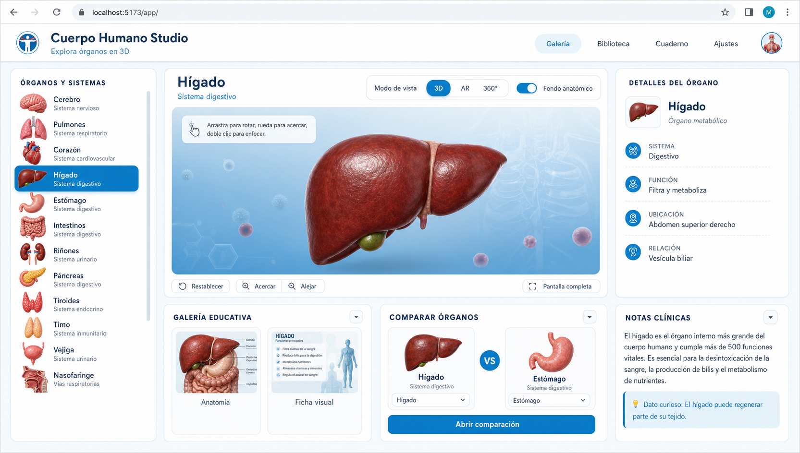
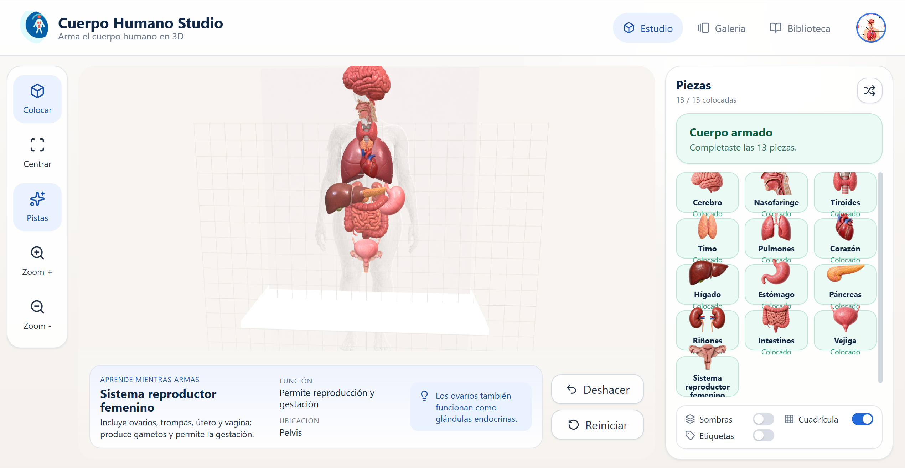
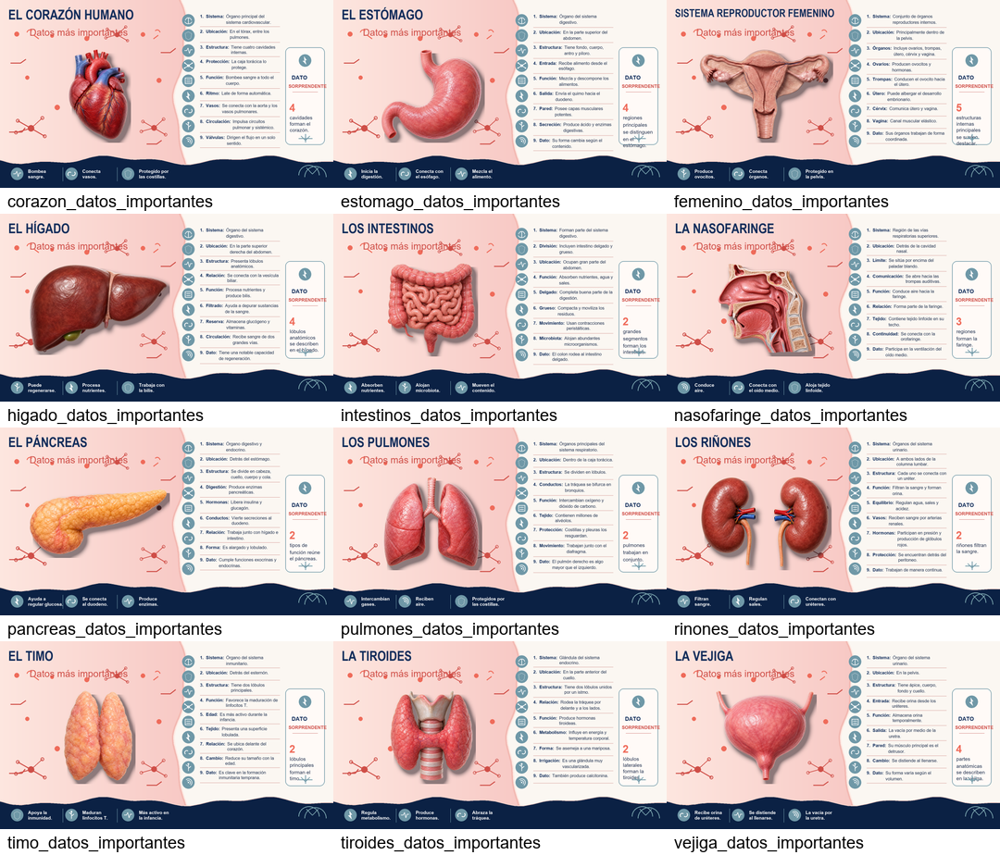

# Cuerpo Humano 3D

Aplicacion web educativa para explorar organos del cuerpo humano con modelos
3D, fichas visuales, anatomia, comparacion entre organos y un modo de estudio
para armar el cuerpo por piezas.



## Video tutorial

En este video explicativo se muestra, paso a paso, como crear una app web
educativa en 3D del cuerpo humano:

[](https://youtu.be/ekpzfhAXsDw?si=hnkY339UvqUOFVXM)

[Ver video en YouTube](https://youtu.be/ekpzfhAXsDw?si=hnkY339UvqUOFVXM)

## Que incluye

- Visor 3D interactivo para modelos `.glb`.
- Galeria educativa con anatomia y ficha visual por organo.
- Comparador de dos organos lado a lado.
- Panel de detalles con sistema, funcion, ubicacion y relacion anatomica.
- Notas clinicas y datos curiosos.
- Modo `Estudio` para armar el cuerpo humano en una escena 3D.



## Organos incluidos

Cerebro, pulmones, corazon, higado, estomago, intestinos, rinones,
pancreas, tiroides, timo, vejiga, nasofaringe y sistema reproductor femenino.



## Descargar el proyecto

Opcion 1: desde GitHub

1. Abre este repositorio en GitHub.
2. Haz clic en `Code`.
3. Selecciona `Download ZIP`.
4. Descomprime la carpeta descargada.

Opcion 2: con Git

```bash
git clone https://github.com/jceronch1/Cuerpo-humano_3D.git
cd Cuerpo-humano_3D/app
```

## Como usar la app

Necesitas tener Node.js instalado. Descargalo desde:

https://nodejs.org

Luego abre una terminal dentro de la carpeta `app` y ejecuta:

```bash
npm start
```

Cuando aparezca el mensaje `Accepting connections at http://localhost:5173`,
abre el navegador en:

```text
http://localhost:5173/app/
```

Para entrar al modo de armado 3D, abre:

```text
http://localhost:5173/app/studio.html
```

Para detener el servidor, vuelve a la terminal y presiona `Ctrl + C`.

## Alternativas de ejecucion

Desde la carpeta `app` tambien puedes ejecutar:

```bash
npm run start:py
```

o:

```bash
npm run start:node
```

La app debe servirse con un servidor local. No abras `index.html` con doble
clic, porque el visor 3D puede no cargar correctamente los modelos `.glb`.

## Estructura

```text
Cuerpo-humano_3D/
|-- app-assets/                     # modelos 3D, miniaturas, anatomia y fichas
|   |-- 3D/
|   |-- anatomia/
|   |-- datos_importantes/
|   |-- identidad/
|   |-- miniaturas/
|   `-- organos_16x9_transparentes/
|-- app/                            # aplicacion web
|   |-- index.html
|   |-- studio.html
|   |-- package.json
|   |-- README.md
|   |-- css/
|   `-- js/
|-- Cuerpo_humano.png               # fondo anatomico del visor
|-- Mockup.png                      # captura de la vista principal
|-- CuerpoHumanoStudio.png          # captura del modo estudio
|-- datos_contact_sheet.png         # resumen visual de fichas
|-- miniatura-cuerpo-humano-3d-jhoni.png
`-- COMO_EJECUTAR.txt
```

## Notas

La aplicacion es estatica: no necesita backend ni base de datos. Los datos
educativos estan en `app/js/data.js` y los recursos se cargan desde las
carpetas locales del proyecto.
